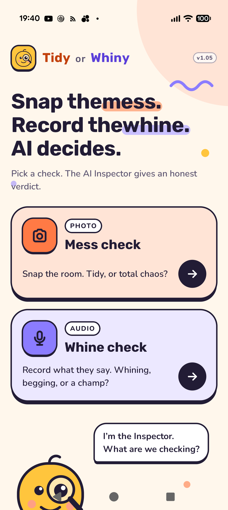
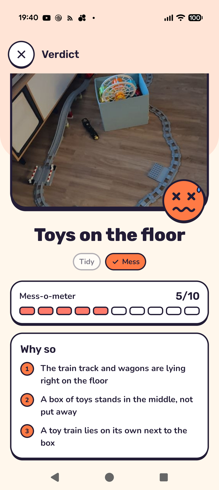
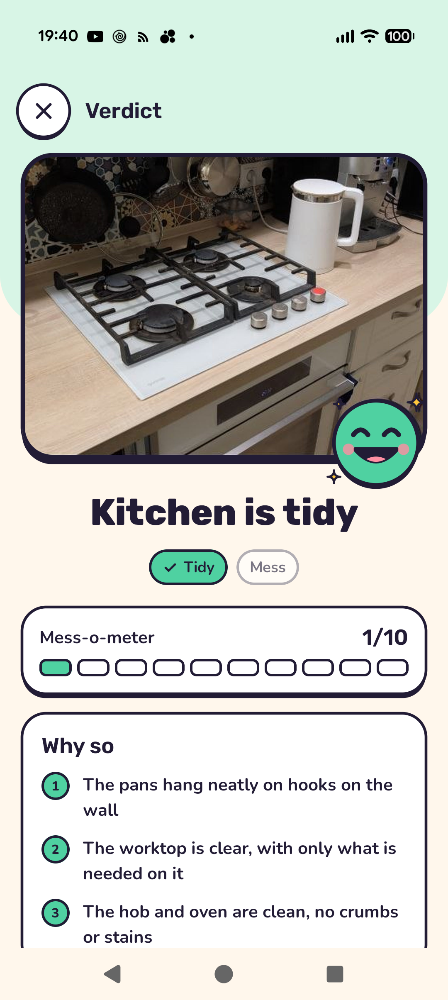
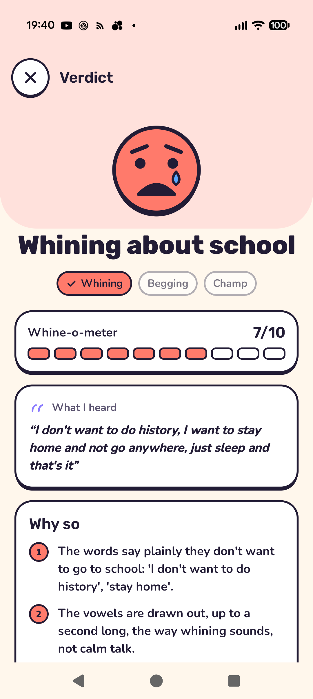

**English** | [Русский](README.ru.md)

# Tidy or Whiny

**Snap the mess. Record the whine. AI decides.**

An Android app for families. Photograph a child's room and the AI Inspector says whether it is tidy or a mess. Record what the child says and it says whether that was whining, begging or a champ's talk. Each verdict comes with a score, the reasons behind it and one kind tip for the child.

<table>
  <tr>
    <td></td>
    <td></td>
    <td></td>
    <td></td>
  </tr>
  <tr>
    <td align="center">Home</td>
    <td align="center">Mess, 5/10</td>
    <td align="center">Tidy, 1/10</td>
    <td align="center">Whining, 7/10</td>
  </tr>
</table>

## What it does

**Mess check** (photo)
- Take a photo or pick one from the gallery.
- Verdict: *Tidy* or *Mess*, and a Mess-o-meter from 0 (spotless) to 10 (total chaos).
- *Why so*: 2 to 4 concrete things the Inspector saw and where they are.
- A tip: what to tidy first, or a word of praise.

**Whine check** (audio)
- Record up to 30 seconds.
- The phone turns the speech into text and measures how the voice sounded: drawn-out vowels, pitch, loudness, tempo.
- Verdict: *Whining*, *Begging* or *Champ*, with a level from 0 to 10.
- The reasons quote the words or name the sound that gave it away. A whine can be caught by the drawn-out vowels even when the words are harmless.

**Details**
- Tips follow the clock. In the evening they are calm (a bath, pyjamas, a book); after bedtime the tip is to go to sleep.
- The interface is in English and Russian, and the Inspector answers in the app's language. On Android 13+ the app's language can be set apart from the phone's: Settings → Apps → Tidy or Whiny → Language.

## How it works

- Kotlin, Jetpack Compose, CameraX. Needs Android 9 or later.
- Speech is recognised by Android's `SpeechRecognizer`, so the Google app has to be installed and enabled.
- The voice is measured on the phone ([VoiceFeatures.kt](app/src/main/java/com/tidyorwhiny/app/speech/VoiceFeatures.kt)). Only the numbers and the transcript are sent to the AI, never the recording.
- The verdict comes from a vision-capable LLM over an OpenAI-style `/chat/completions` API ([QwenClient.kt](app/src/main/java/com/tidyorwhiny/app/ai/QwenClient.kt), prompts in [Inspector.kt](app/src/main/java/com/tidyorwhiny/app/ai/Inspector.kt)).

**Privacy:** the photo, the transcript and the voice measurements go to the AI service the build is set up with. Debug builds also keep each recording on the phone (WAV plus what was heard and measured) in `Android/data/com.tidyorwhiny.app/files/voice/`.

## Two builds

The AI settings are not in the repository. What the build does depends on one local file.

| | `qwen.json` present | No `qwen.json` |
|---|---|---|
| Build | **Family build** | **Public build** |
| AI | The Qwen gateway, model and key from the file, baked into the APK | None yet. A "Sign in with OpenRouter" is planned, so each user can bring their own account |

`qwen.json` is git-ignored. [qwen.example.json](qwen.example.json) shows its shape:

```json
{
  "base_url": "https://your-gateway/v1",
  "model": "your-model",
  "api_key": "..."
}
```

If the file is there but a field is empty, the build stops with an error rather than quietly building the public app.

> The key in a family APK can be pulled out of it. Keep that APK in the family.

## Building

You need JDK 17 and the Android SDK (`ANDROID_HOME`, or Android Studio's default location).

```sh
cp qwen.example.json qwen.json     # family build only: fill in the three values
./gradlew assembleDebug            # gradlew.bat on Windows
```

The APK is written to `app/build/outputs/apk/debug/TidyOrWhiny_<version>.apk`.

The VS Code tasks in [.vscode/tasks.json](.vscode/tasks.json):
- **TOW: Run on Phone**: build, install and start the app over adb.
- **TOW: Logcat (Inspector)**: the app's log.
- **TOW: Pull voice recordings**: copy the debug recordings to `tools/whine/data/own/`.

For screenshots, a debug build can open a verdict screen straight from a JSON file without asking the AI. The file format and the adb commands are in [Demo.kt](app/src/main/java/com/tidyorwhiny/app/Demo.kt).

## Voice tools

[tools/whine/](tools/whine/) is a Python copy of the on-phone voice measures ([features.py](tools/whine/features.py)). It is used to check which measures really tell a whine from calm speech:

- [audioset.py](tools/whine/audioset.py) and [freesound.py](tools/whine/freesound.py) download labelled clips (AudioSet, Creative Commons Freesound).
- [evaluate.py](tools/whine/evaluate.py) compares the measures across classes.
- [synth.py](tools/whine/synth.py) makes synthetic voices with known answers for the Kotlin test.

They need Python 3.11 with `numpy`, `scipy`, `imageio-ffmpeg` and `yt-dlp` in `tools/.venv`. Downloaded clips stay local (`tools/whine/data/` is git-ignored).

## Layout

```
app/src/main/java/com/tidyorwhiny/app/
  ai/        QwenClient (LLM calls), Inspector (prompts and verdicts)
  speech/    SpeechCapture (mic + recognizer), VoiceFeatures (how the voice sounded)
  ui/        screens, components, theme
tools/whine/ voice-measure checks in Python
```
