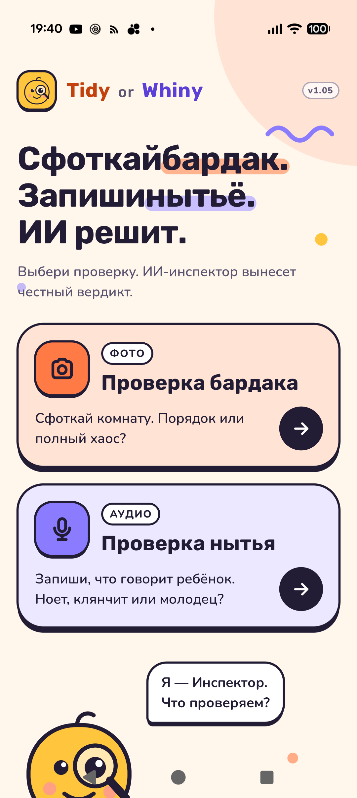
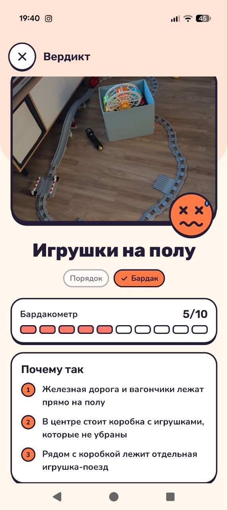
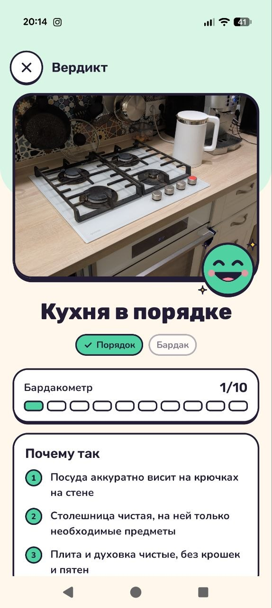
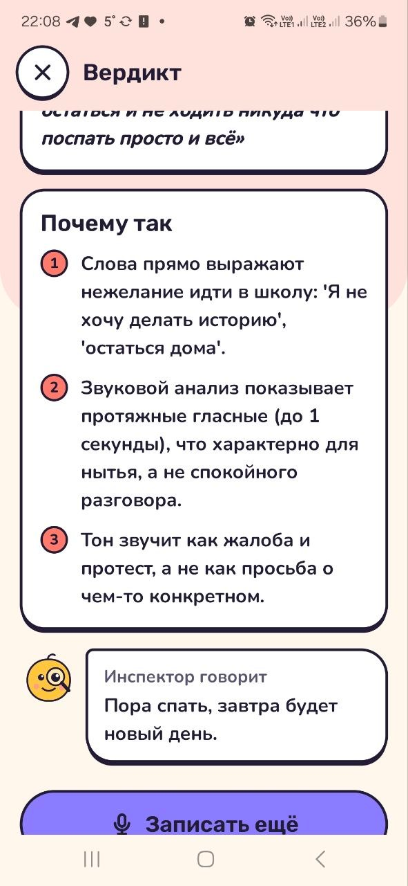

[English](README.md) | **Русский**

# Tidy or Whiny

**Сфоткай бардак. Запиши нытьё. ИИ решит.**

Android-приложение для семьи. Сфотографируйте детскую, и ИИ-Инспектор скажет, порядок там или бардак. Запишите, что говорит ребёнок, и Инспектор скажет: ноет он, клянчит или говорит как молодец. К каждому вердикту Инспектор даёт оценку, объясняет, почему так решил, и даёт ребёнку один добрый совет.

<table>
  <tr>
    <td></td>
    <td></td>
    <td></td>
    <td></td>
  </tr>
  <tr>
    <td align="center">Главный экран</td>
    <td align="center">Бардак, 5/10</td>
    <td align="center">Порядок, 1/10</td>
    <td align="center">Нытьё и совет перед сном</td>
  </tr>
</table>

## Что умеет

**Проверка бардака** (фото)
- Сделайте снимок или выберите фото из галереи.
- Вердикт: *Порядок* или *Бардак*, и Бардакометр от 0 (идеально) до 10 (полный хаос).
- *Почему так*: 2–4 конкретные вещи, которые Инспектор увидел, и где они лежат.
- Совет: что убрать первым, или похвала.

**Проверка нытья** (звук)
- Запишите до 30 секунд.
- Телефон распознаёт слова и измеряет, как звучал голос: протяжные гласные, высоту, громкость, темп.
- Вердикт: *Нытьё*, *Клянчит* или *Молодец*, с уровнем от 0 до 10.
- В причинах Инспектор цитирует слова или называет звук, который выдал нытьё. Протяжные гласные выдают нытьё, даже когда сами слова безобидные.

**Детали**
- Совет подстраивается под время суток. Вечером он спокойный (ванна, пижама, книжка), после отбоя — ложиться спать.
- Интерфейс на русском и английском, Инспектор отвечает на языке приложения. На Android 13+ язык приложения можно выбрать отдельно от телефона: Настройки → Приложения → Tidy or Whiny → Язык.

## Как устроено

- Kotlin, Jetpack Compose, CameraX. Нужен Android 9 или новее.
- Речь распознаёт системный `SpeechRecognizer`, поэтому должно быть установлено и включено приложение Google.
- Голос измеряется на телефоне ([VoiceFeatures.kt](app/src/main/java/com/tidyorwhiny/app/speech/VoiceFeatures.kt)). В ИИ уходят только цифры и распознанный текст, сама запись не уходит.
- Вердикт выносит LLM с поддержкой изображений через OpenAI-совместимый `/chat/completions` ([QwenClient.kt](app/src/main/java/com/tidyorwhiny/app/ai/QwenClient.kt), промпты в [Inspector.kt](app/src/main/java/com/tidyorwhiny/app/ai/Inspector.kt)).

**Приватность:** фото, распознанный текст и измерения голоса отправляются в ИИ-сервис, на который настроена сборка. Отладочная сборка ещё и сохраняет каждую запись на телефоне (WAV плюс что услышано и измерено) в `Android/data/com.tidyorwhiny.app/files/voice/`.

## Две сборки

Настроек ИИ в репозитории нет. Что получится при сборке, зависит от одного локального файла.

| | Есть `qwen.json` | Нет `qwen.json` |
|---|---|---|
| Сборка | **Семейная** | **Публичная** |
| ИИ | Шлюз, модель и ключ Qwen из файла, вшитые в APK | Пока нет. Планируется «Войти через OpenRouter», чтобы каждый подключал свой аккаунт |

`qwen.json` в `.gitignore`. Его формат показан в [qwen.example.json](qwen.example.json):

```json
{
  "base_url": "https://your-gateway/v1",
  "model": "your-model",
  "api_key": "..."
}
```

Если файл есть, но какое-то поле пустое, сборка остановится с ошибкой, а не соберёт молча публичную версию.

> Ключ из семейного APK можно вытащить. Не отдавайте этот APK за пределы семьи.

## Сборка

Нужны JDK 17 и Android SDK (`ANDROID_HOME` или стандартная папка Android Studio).

```sh
cp qwen.example.json qwen.json     # только для семейной сборки: заполнить три значения
./gradlew assembleDebug            # на Windows: gradlew.bat
```

APK появится в `app/build/outputs/apk/debug/TidyOrWhiny_<версия>.apk`.

Задачи VS Code в [.vscode/tasks.json](.vscode/tasks.json):
- **TOW: Run on Phone** — собрать, поставить и запустить через adb.
- **TOW: Logcat (Inspector)** — лог приложения.
- **TOW: Pull voice recordings** — забрать отладочные записи в `tools/whine/data/own/`.

Для скриншотов отладочная сборка умеет открыть экран вердикта прямо из JSON-файла, без запроса к ИИ. Формат файла и команды adb описаны в [Demo.kt](app/src/main/java/com/tidyorwhiny/app/Demo.kt).

## Инструменты для голоса

[tools/whine/](tools/whine/) — копия на Python тех же измерений голоса, что на телефоне ([features.py](tools/whine/features.py)). С её помощью проверяется, какие измерения действительно отличают нытьё от спокойной речи:

- [audioset.py](tools/whine/audioset.py) и [freesound.py](tools/whine/freesound.py) скачивают размеченные клипы (AudioSet, Freesound под Creative Commons).
- [evaluate.py](tools/whine/evaluate.py) сравнивает измерения по классам.
- [synth.py](tools/whine/synth.py) делает синтетические голоса с известным ответом для Kotlin-теста.

Нужен Python 3.11 с `numpy`, `scipy`, `imageio-ffmpeg` и `yt-dlp` в `tools/.venv`. Скачанные клипы остаются локально (`tools/whine/data/` в `.gitignore`).

## Структура

```
app/src/main/java/com/tidyorwhiny/app/
  ai/        QwenClient (запросы к LLM), Inspector (промпты и вердикты)
  speech/    SpeechCapture (микрофон + распознавание), VoiceFeatures (как звучал голос)
  ui/        экраны, компоненты, тема
tools/whine/ проверка измерений голоса на Python
```
